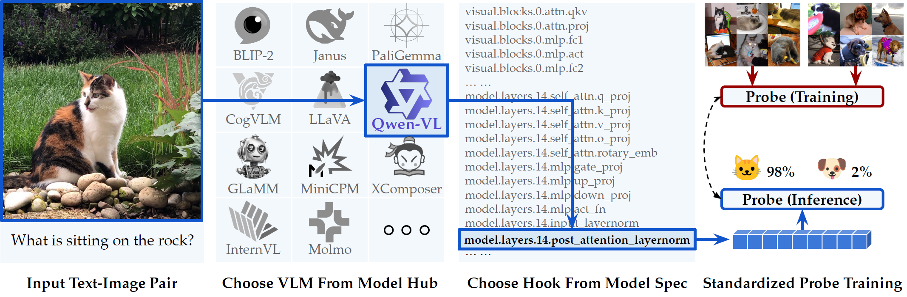

#  VLM-Lens

[](https://www.python.org/downloads/release/python-31012/)
[](https://www.apache.org/licenses/LICENSE-2.0)
[](https://arxiv.org/abs/2510.02292)
[](https://compling-wat.github.io/vlm-lens/)

[](tutorial-notebooks/guide.ipynb)
[](https://colab.research.google.com/drive/13WC4HA6syXFotmn7S8WsVz4OmoHsfHV9?usp=sharing)
[](https://huggingface.co/spaces/marstin/VLM-Lens)


<p align="center">
  
</p>

## Table of Contents

- [Environment Setup](#environment-setup)
- [Example Usage: Extract Qwen2-VL-2B Embeddings with VLM-Lens](#example-usage-extract-qwen2-vl-2b-embeddings-with-vlm-lens)
  - [General Command-Line Demo](#general-command-line-demo)
  - [Run Qwen2-VL-2B Embeddings Extraction](#run-qwen2-vl-2b-embeddings-extraction)
- [Layers of Interest in a VLM](#layers-of-interest-in-a-vlm)
  - [Retrieving All Named Modules](#retrieving-all-named-modules)
  - [Matching Layers](#matching-layers)
- [Feature Extraction using HuggingFace Datasets](#feature-extraction-using-huggingface-datasets)
- [Output Database](#output-database)
- [Demo: Principal Component Analysis over Primitive Concept](#principal-component-analysis-over-primitive-concept)
- [Contributing to VLM-Lens](#contributing-to-vlm-lens)
- [Miscellaneous](#miscellaneous)

## Environment Setup
We use [uv](https://docs.astral.sh/uv/) to manage dependencies. Install it once:
```bash
curl -LsSf https://astral.sh/uv/install.sh | sh
```

Each supported model is exposed as an optional extra in `pyproject.toml`
(e.g., `base`, `cogvlm`, `glamm`, `internvl`, `molmo`, ...). Because different
models pin incompatible `torch`/`transformers` versions, each model gets its
own dedicated virtual environment. Use the bundled switcher script to create
and activate one:
```bash
source scripts/use.sh base       # or cogvlm, glamm, internvl, molmo, ...
```
The first invocation for an extra creates a venv under `.venvs/<extra>/` and
installs the model's dependencies from the locked `uv.lock`. Subsequent
invocations just reactivate the existing venv. To switch models, simply
re-source the script with a different extra.

Other available extras: `demo` (Gradio app), `concepts` (PCA / probing tools),
`docs` (Sphinx build).

To add or update a dependency, edit `pyproject.toml` and run `uv lock` to
regenerate the lockfile.

**Notes**:
1. There may be local constraints (e.g., issues caused by cluster regulations) that cause failure of the above commands. In such cases, you are encouraged to modify it whenever fit. We welcome issues and pull requests to help us keep the dependencies up to date.
2. Some models, due to the resources available at the development time, may not be fully supported on modern GPUs. While our released environments are tested on L40s GPUs, we recommend following the error messages to adjust the environment setups for your specific hardware.
3. Some models (`glamm`, `minicpm-o`, `minicpm-v`, `pixtral`) need `flash-attn`, which must be built from source against the resolved `torch` and is not bundled in the extra. After the initial `uv sync`, install it with the version pinned in the inline comment in `pyproject.toml`, e.g. `uv pip install flash-attn==<version> --no-build-isolation`. A matching CUDA toolchain is required on the host.

## Example Usage: Extract Qwen2-VL-2B Embeddings with VLM-Lens

### General Command-Line Demo

The general command to run the quick command-line demo is:
```bash
python -m src.main \
  --config <config-file-path> \
  --debug
```
with an optional debug flag to see more detailed outputs.

Note that the config file should be in yaml format, and that any arguments you want to send to the huggingface API should be under the `model` key.
See `configs/models/qwen/qwen-2b.yaml` as an example.

### Run Qwen2-VL-2B Embeddings Extraction
The file `configs/models/qwen/qwen-2b.yaml` contains the configuration for running the Qwen2-VL-2B model.

```yaml
architecture: qwen  # Architecture of the model, see more options in src/models/configs.py
model_path: Qwen/Qwen2-VL-2B-Instruct  # HuggingFace model path
model:  # Model configuration, i.e., arguments to pass to the model
  - torch_dtype: auto
output_db: output/qwen.db  # Output database file to store embeddings
input_dir: ./data/  # Directory containing images to process
prompt: "Describe the color in this image in one word."  # Textual prompt
pooling_method: None  # Pooling method to use for aggregating token embeddings over tokens (options: None, mean, max)
modules:  # List of modules to extract embeddings from
  - lm_head
  - visual.blocks.31
```

To run the extraction on available GPU, use the following command:
```bash
python -m src.main --config configs/models/qwen/qwen-2b.yaml --debug
```

If there is no GPU available, you can run it on CPU with:
```bash
python -m src.main --config configs/models/qwen/qwen-2b.yaml --device cpu --debug
```

## Layers of Interest in a VLM
### Retrieving All Named Modules
Unfortunately there is no way to find which layers to potentially match to without loading the model. This can take quite a bit of system time figuring out.

Instead, we publish a browsable **[Model Cards site](https://compling-wat.github.io/vlm-lens/models/index.html)** with one card per supported checkpoint. Each card shows the full module tree, parameter counts, and the **output shape each module produces during a real forward pass** — paste the qualified module name straight into the `modules:` field of your config.

To regenerate a card locally (e.g. after a `transformers` upgrade or for a new checkpoint), pass the `-l` / `--log-named-modules` flag when running `python -m src.main`; it writes a structured JSON to `docs/_data/cards/<namespace>/<model_name>.json` that feeds the docs build. The legacy flat `logs/<namespace>/<model_name>.txt` listings remain in place as a backup during the card-site rollout and will be removed in a follow-up.

When running with `-l`, it is not necessary to set `modules:` or anything besides the architecture and HuggingFace model path.

### Matching Layers
To automatically set up which layers to find/use, one should use the Unix style strings, where you can use `*` to denote wildcards.

For example, if one wanted to match with all the attention layer's query projection layer for Qwen, simply add the following lines to the .yaml file:
```
modules:
  - model.layers.*.self_attn.q_proj
```
## Feature Extraction using HuggingFace Datasets
To use VLM-Lens with either hosted or local datasets, there are multiple methods you can use depending on the location of the input images.

First, your dataset must be standardized to a format that includes the attributes of `prompt`, `label` and `image_path`. Here is a snippet of the `compling/coco-val2017-obj-qa-categories` dataset, adjusted with the former attributes:

| id | prompt | label | image_path |
|---|---|---|---|
| 397,133 | Is this A photo of a dining table on the bottom | yes | /path/to/397133.png
| 37,777 | Is this A photo of a dining table on the top | no | /path/to/37777.png

This can be achieved manually or using the helper script in `scripts/map_datasets.py`.

### Method 1: Using hosted datasets
If you are using datasets hosted on a platform such as HuggingFace, you will either use images that are also *hosted*, or ones that are *downloaded locally* with an identifier to map back to the hosted dataset (e.g., filename).

You must use the `dataset_path` attribute in your configuration file with the appropriate `dataset_split` (if it exists, otherwise leave it out).

#### 1(a): Hosted Dataset with Hosted Images
```yaml
dataset:
  - dataset_path: compling/coco-val2017-obj-qa-categories
  - dataset_split: val2017
```

#### 1(b): Hosted Dataset with Local Images

> 🚨 **NOTE**: The `image_path` attribute in the dataset must contain either filenames or relative paths, such that a cell value of `train/00023.png` can be joined with `image_dataset_path` to form the full absolute path: `/path/to/local/images/train/00023.png`. If the `image_path` attribute does not require any additional path joining, you can leave out the `image_dataset_path` attribute.

```yaml
dataset:
  - dataset_path: compling/coco-val2017-obj-qa-categories
  - dataset_split: val2017
  - image_dataset_path: /path/to/local/images  # downloaded using configs/dataset/download-coco.yaml
```


### Method 2: Using local datasets
#### 2(a): Local Dataset containing Image Files
```yaml
dataset:
  - local_dataset_path: /path/to/local/CLEVR
  - dataset_split: train # leave out if unspecified
```

#### 2(b): Local Dataset with Separate Input Image Directory

> 🚨 **NOTE**: The `image_path` attribute in the dataset must contain either filenames or relative paths, such that a cell value of `train/00023.png` can be joined with `image_dataset_path` to form the full absolute path: `/path/to/local/images/train/00023.png`. If the `image_path` attribute does not require any additional path joining, you can leave out the `image_dataset_path` attribute.

```yaml
dataset:
  - local_dataset_path: /path/to/local/CLEVR
  - dataset_split: train # leave out if unspecified
  - image_dataset_path: /path/to/local/CLEVR/images
```

### Output Database
Specified by the `-o` and `--output-db` flags, this specifies the specific output database we want. From this, in SQL we have a single table under the name `tensors` with the following columns:
```
name, architecture, timestamp, image_path, prompt, label, layer, tensor_dim, tensor
```
where each column contains:
1. `name` represents the model path from HuggingFace.
2. `architecture` is the supported flags above.
3. `timestamp` is the specific time that the model was ran.
4. `image_path` is the absolute path to the image.
5. `prompt` stores the prompt used in that instance.
6. `label` is an optional cell that stores the "ground-truth" answer, which is helpful in use cases such as classification.
7. `layer` is the matched layer from `model.named_modules()`
8. `pooling_method` is the pooling method used for aggregating token embeddings over tokens.
9. `tensor_dim` is the dimension of the tensor saved.
10. `tensor` is the embedding saved.

## Principal Component Analysis over Primitive Concept

### Data Collection

Download license-free images for primitive concepts (e.g., colors):

```bash
source scripts/use.sh concepts
python -m data.concepts.download --config configs/concepts/colors.yaml
```

### Embedding Extraction

Run the LLaVA model to obtain embeddings of the concept images:

```bash
python -m src.main --config configs/models/llava-7b/llava-7b-concepts-colors.yaml --device cuda
```

Also, run the LLaVA model to obtain embeddings of the test images:

```bash
python -m src.main --config configs/models/llava-7b/llava-7b.yaml --device cuda
```

### Run PCA

Several PCA-based analysis scripts are provided:
```bash
source scripts/use.sh concepts
python -m src.concepts.pca
python -m src.concepts.pca_knn
python -m src.concepts.pca_separation
```

## Run Gradio Demo Locally

Install additional dependencies and launch the app.

```bash
source scripts/use.sh demo
python -m demo.launch_gradio
```

## Contributing to VLM-Lens

We welcome contributions to VLM-Lens! If you have suggestions, improvements, or bug fixes, please consider submitting a pull request, and we are actively reviewing them.

We generally follow the [Google Python Styles](https://google.github.io/styleguide/pyguide.html) to ensure readability, with a few exceptions stated in `.flake8`.
We use pre-commit hooks to ensure code quality and consistency---please make sure to run the following scripts before committing:
```python
pip install pre-commit
pre-commit install
```


## Miscellaneous

### Using a Cache
To use a specific cache, one should set the `HF_HOME` environment variable as so:
```
HF_HOME=./cache/ python -m src.main --config configs/models/clip/clip.yaml --debug
```


### Using Submodule-Based Models
There are some models that require separate submodules to be cloned, such as Glamm.
To use these models, please follow the instructions below to download the submodules.

#### Glamm
For Glamm (GroundingLMM), one needs to clone the separate submodules, which can be done with the following command:
```
git submodule update --recursive --init
```

See [our document](https://compling-wat.github.io/vlm-lens/tutorials/grounding-lmm.html) for details on the installation.


## Citation

```bibtex
@inproceedings{vlmlens,
  title={From Behavioral Performance to Internal Competence: Interpreting Vision-Language Models with VLM-Lens},
  author={Hala Sheta and Eric Huang and Shuyu Wu and Ilia Alenabi and Jiajun Hong and Ryker Lin and Ruoxi Ning and Daniel Wei and Jialin Yang and Jiawei Zhou and Ziqiao Ma and Freda Shi},
  booktitle={Proceedings of the 2025 Conference on Empirical Methods in Natural Language Processing: System Demonstrations},
  year={2025}
}
```
